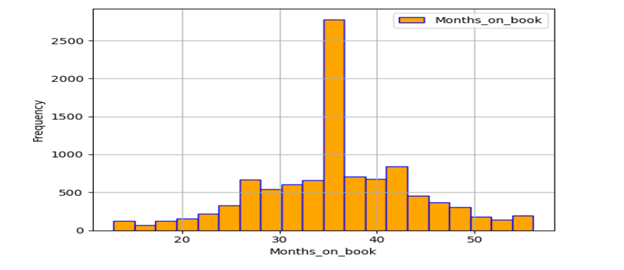
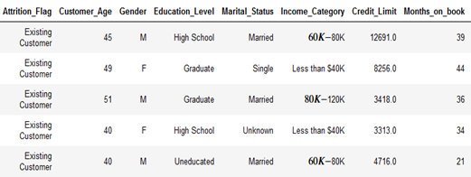
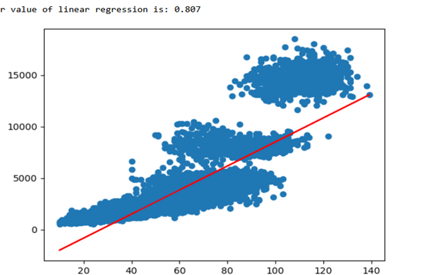
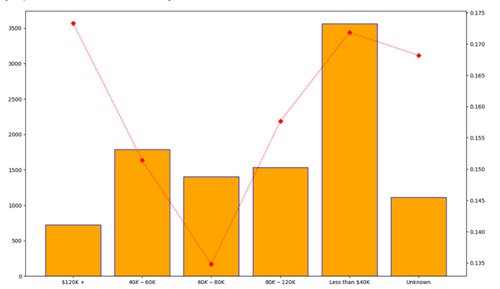
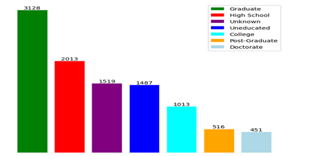
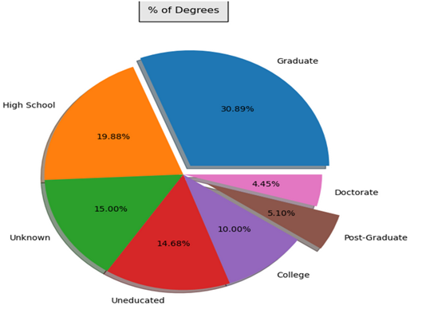
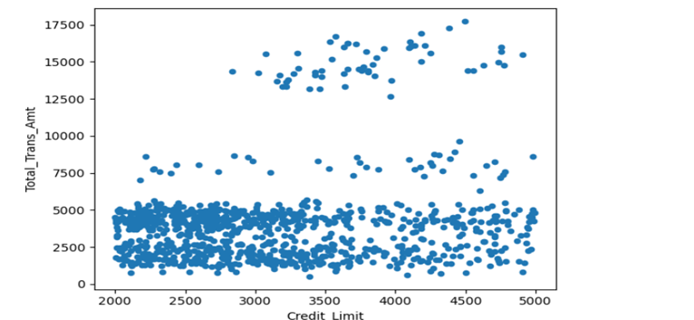
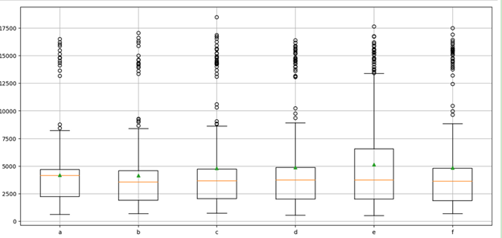
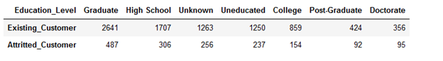
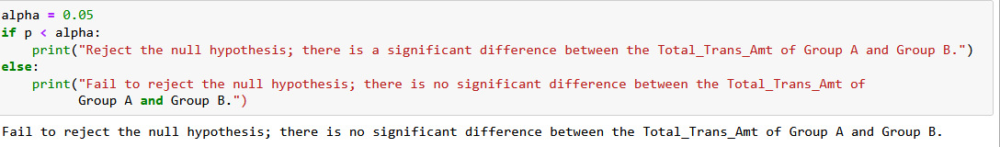

# Logs
##### October 28 2023   
> upload source file credit_card.csv, please download
##### October 28 2023   
> create Manal's branch
##### Nov 1 2023   
> upload "Manal's plotting"   
> upload "Data Visulization Project one.ipynb"
##### Nov 4 2023
> upload "Manal's TTest.ipynb"    
> upload "Our Group Analysis"   
> upload "Data Visulization Project one.ipynb"   
# Our Group Analysis:    
# Dataset Description:   
#This credit card dataset consists of 10,000 datasets for different customers according to their education level, gender, income level, total transaction amount on their credit card, and how long these accounts are on the book. The data is about twenty columns; it shows the spending habits of these customers. 

#From our dataset, there are two types of customers: the existing customers that continue to open credit card accounts and the attrition customers that cease to exist because they closed their credit card accounts, the credit card companies canceled their accounts, and they had no activity on their credit card.    
### Columns
* CLIENTNUM: this is customer_id
* Attrition_flag: contains existing customer and attrited customer.
* Customer_Age: contains customers of different ages.
* Gender: deals with whether the customers are male or female.
* Dependent_count: deals with the number of dependents per household.
* Education_level: deals with the education level of customers whether they are in high school, graduate, uneducated, college,   post-graduate, doctorate, or unknown status.
* Marital_Status: deals with the different customer statuses if they are married, single, divorced, or unknown.
* Income_Category: contains the different income levels for various customers.
* Card_Category: contains the various credit cards and their credit limit.
* Months_on_books: contains how long the credit card balance stayed on the bank's record.
* Avg_Open_To_Buy: contains the average open credit card. 
* Total_Trans_Amt: contains the total transaction amounts for customers that have credit cards.
* Total_Trans_Ct: contains the total count for credit card transactions.   
# Through our group project, our data answers the following questions:   
# How does income affect credit card debt?   
#From our analysis, we notice that income affects credit card debt. From the charts below, more customer default on their credit cards as their income goes up. 

#From the table below, we notice more credit card debt in higher-income customers than in lower-income customers. Customers     with income higher income (120K) default by 17.33% than those with income less than ($40K); they default by about 17.19%.    

#Please see the table and row chart below:   

my_picturename   
# What causes most credit card debt?   
* There are so many reasons for credit card debt. One of these causes is that customers pay the minimum on their credit cards, and that is shown in the histogram below:  
   

my_picturename   
* From that histogram, customers here default on their cr   
edit cards, and their accounts age, and in the long run, their accounts stay longer than 44 months on the books. 

* These accounts cause customers with less than 40K to have bad credit rating than customers with higher income 80K to 120K, their accounts last for 36 months.   

my_picturename    
*Also, there is a strong linear regression relationship between the total count and the total amount of credit card transactions. That relationship causes the amount and count of credit card transactions to move in the same direction. That means that as more customers open credit cards, they only pay the minimum amount, and that causes their total amount of credit card amount to increase.    

my_picturename   
# Is credit card debt worse for those with higher income or lower income?   
* In our analysis, we notice that credit card debt is worse for those with higher incomes than those with lower incomes. The higher the income, the more debt customers tend to fall into because those customers want to buy everything, they want the better homes, cars, and vacations; for example, customers that have an income less than 40k have a percentage of 17.19% of credit card debt. Customers with income greater than 120k have a percentage of about 17.33.   

my_picturename   
# Is there a correlation between income, education, and credit card debt?   
* There is a strong correlation between income, education, and credit card debt. In the relationship between education and credit card debt, customers with graduate degrees default more on their credit card debt than high school, uneducated, college, post-graduate, and doctorate customers. As shown in the bar charts below, the value count for graduates is about 3,128, which is higher than the value count for high school customers, which is about 2,013.    

my_picturename   
* The higher the education, the higher the credit card debt because customers with graduate degrees spend more than other customers. The pie chart below shows that the graduate students' spending is about 30.89%, which is higher than the spending of the high school customers, who spend approximately 19.88%, and the spending of the uneducated customers, who spend about 14.68%. In that pie chart, the smallest value count is for the postgraduate customers, who spend about 5.10%, while the highest is for the graduate customers, who spend 30.89%.   
 
my_picturename   
* Furthermore, there is a relationship between income and credit card debt. From our analysis, we see that the income level greater than 120K is about 17.33% more than the income for customers that earn 40K to 60K, which is approximately 15.14%.  

* As income increases, there is more credit card debt, as higher-income customers spend more on their credit cards than lower-income customers. These customers want to live better, have bigger homes, and take vacations. These customers have access to a larger credit limit because of their income.   
# TESTS   
#TTest Result: we realized that if you decrease the customer’s credit limit, their total transactions will significantly decrease. In order to limit the customers’ spending, we have to decrease their credit limit. We have tested that on the data below:   

my_picturename   

my_picturename   
#Anova:It is is an extension of the Ttest, the distribution is significantly different because the mean value is different 
in six different groups and outlier group (Q3+1.5IQR) is different. So, these six groups have significant differences.   

my_picturename   
#CHI Square test is another test to test if there is a relationship or no relationship between the data. Here the P is greater than 0.05 so there is no relationship, so there is no hypothesis. We tested Group A and B, and in the result: there is fail to reject the null hypothesis; there is no significant difference between the Total_Trans_Amt of Group A and Group B.   

my_picturename   

my_picturename   
# Works Cited

Knowledge, H. W. (2013, November 11). A Smarter Way To Reduce Customer Churn. Forbes. https://www.forbes.com/sites/hbsworkingknowledge/2013/11/11/a-smarter-way-to-reduce-customer-churn/?sh=1d57f8b02c0a

Martin, E. J. (n.d.). Attacking credit card debt as a higher earner. Bankrate. https://www.bankrate.com/finance/credit-cards/high-earners-in-debt/#issue 

